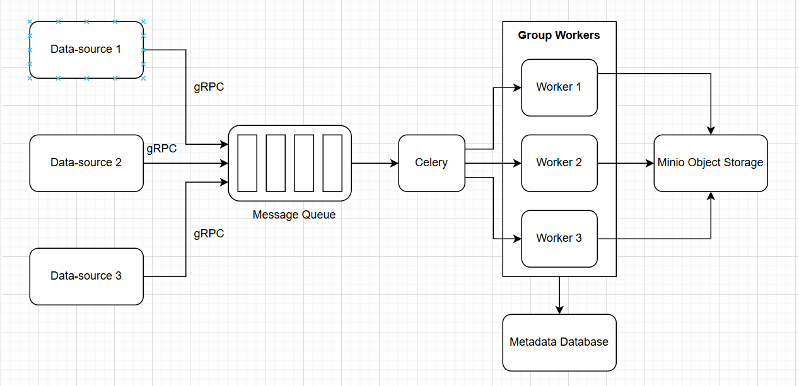

### Design of The project Big-data Platform

Below is the general design of my Big-data Platform project for dataset MIMII Dataset: Sound Dataset for Malfunctioning Industrial Machine Investigation and Inspection.

    

The following is the tech stack used for each component of the design:

- Message Queue: Kafka

- Zookeeper: Kazoo

- Metadata Database: MongoDB

- Object Storage: Minio

- Task monitor: celery

- Upload wave file via boto3 for minio